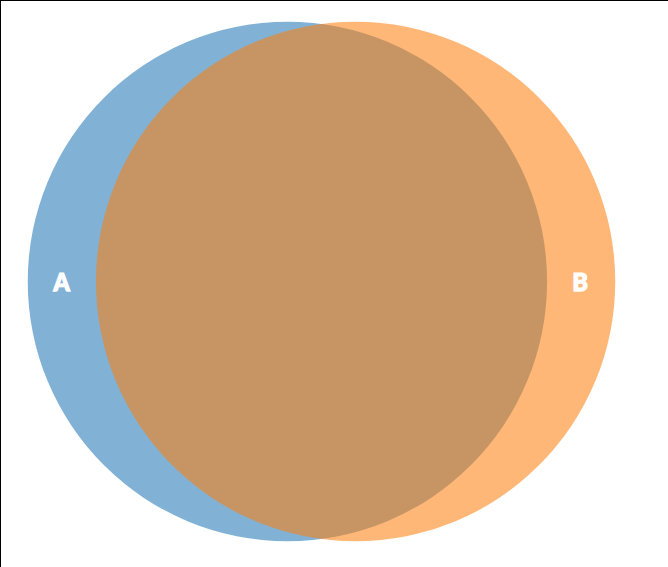
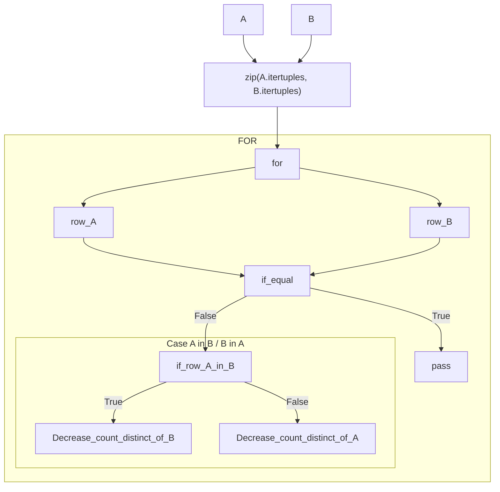
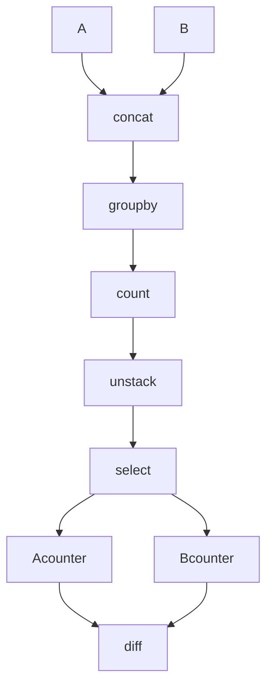

# pandas-sets: distinct

## El problema

Dados dos conjuntos (dataframes) A y B, quiero obtener los conjuntos (las
filas) que no pertenecen a la intersección. Es decir, los items que son
distintos entre ambos conjuntos.




### con un ejemplo

Aunque parece un problema sencillo, tiene bastante casuística.

Notar que:

- Los indices pueden  repetirse.
- comparación element-wise no es posible porque el orden importa y en el DF
  pueden estar desordenados.
- No quiero perder información de cuantas veces se repite un item del conjunto.


### Naive
```python
left = pd.DataFrame([
    [1, 2, 3],
    [1, 2, 33]           # diff <---+
])                       #          |
                         #          |
right = pd.DataFrame([   #          |
    [1, 2, 3],           #          |
    [1, 2, 3]            # diff <---+
])
# Después de hacer: pandas_distinct(left, right)
left_expected = pd.DataFrame([[1, 2, 33]], index=[1])
right_expected = pd.DataFrame([[1, 2, 3]], index=[1])

left_obtained, right_obtained = utils.distinct(left, right)
```


### Complejo

```python
left = pd.DataFrame([
    [1, 2, 3],  # a
    [1, 2, 3],  # a
    [1, 2, 33]  # b
    ],
    index=["a", "a", "b"],
)
right = pd.DataFrame([
    [1, 2, 3],  # a
    [1, 2, 33]  # b
    ],
    index=["b"],
)

left_expected = pd.DataFrame([
    [1, 2, 3], # a
    ],
    index=["a"],
)
right_expected = pd.DataFrame([], columns=[0, 1, 2], index=[])

left_obtained, right_obtained = utils.distinct(left, right, subset=[1, 2])
```


### Manteniendo el comportamiento que tienen los conjuntos:


Quiero mantener el mismo comportamiento que en los `set`:

```python
>>> l = {1,2,3}
>>> r = {1,3}
>>> l - r
{2}
>>> r - l
set()
>>>
```


# Implementación naive

`utils.distinct`



## Pandas implementation

`utils.distinct_groupby`



## Pandas vs Naive

```python
----------------------------------------------------------------------------------------------- benchmark: 8 tests -----------------------------------------------------------------------------------------------
Name (time in ms)                                     Min                Max               Mean            StdDev             Median             IQR            Outliers       OPS            Rounds  Iterations
------------------------------------------------------------------------------------------------------------------------------------------------------------------------------------------------------------------
test_comparison_naive[distinct-10]                 1.0237 (1.0)       1.4164 (1.0)       1.0583 (1.0)      0.0613 (1.0)       1.0430 (1.0)    0.0131 (1.0)           5;9  944.9231 (1.0)         100          10
test_comparison_naive[distinct-100]                1.1522 (1.13)      2.1234 (1.50)      1.2008 (1.13)     0.1096 (1.79)      1.1795 (1.13)    0.0177 (1.35)          5;7  832.7471 (0.88)        100          10
test_comparison_naive[distinct-1000]               2.3129 (2.26)      2.7982 (1.98)      2.3677 (2.24)     0.0875 (1.43)      2.3484 (2.25)    0.0256 (1.95)          5;6  422.3528 (0.45)        100          10
test_comparison_naive[distinct-10000]             13.9817 (13.66)    15.0694 (10.64)    14.4608 (13.66)    0.2536 (4.13)     14.4760 (13.88)    0.3643 (27.77)        34;0   69.1523 (0.07)        100          10
test_comparison_naive[distinct_groupby-10]         8.9437 (8.74)     10.0162 (7.07)      9.3069 (8.79)     0.2271 (3.70)      9.2416 (8.86)    0.1609 (12.27)       24;17  107.4467 (0.11)        100          10
test_comparison_naive[distinct_groupby-100]        9.3132 (9.10)     10.3139 (7.28)      9.5322 (9.01)     0.2400 (3.91)      9.4478 (9.06)    0.1539 (11.73)       20;20  104.9080 (0.11)        100          10
test_comparison_naive[distinct_groupby-1000]       9.6025 (9.38)     11.8862 (8.39)      9.8512 (9.31)     0.3303 (5.39)      9.7036 (9.30)    0.3821 (29.13)        18;2  101.5101 (0.11)        100          10
test_comparison_naive[distinct_groupby-10000]     11.8003 (11.53)    17.6023 (12.43)    12.1803 (11.51)    0.6781 (11.06)    11.9706 (11.48)    0.4115 (31.37)         8;4   82.0999 (0.09)        100          10
------------------------------------------------------------------------------------------------------------------------------------------------------------------------------------------------------------------
```


## Update 1

### counter!!!


```
from collections import Counter
import pandas as pd


Counter()

left = pd.DataFrame([
    [1, 2, 3],  # a
    [1, 2, 3],  # a
    [1, 2, 33]  # b
    ],
    index=["a", "a", "b"],
)
right = pd.DataFrame([
    [1, 2, 3],  # a
    [1, 2, 33]  # b
    ],
    index=["a", "b"],
)

left_expected = pd.DataFrame([
    [1, 2, 3], # a
    ],
    index=["a"],
)
right_expected = pd.DataFrame([], columns=[0, 1, 2], index=[])


left_counter = Counter(left.itertuples(index=False))
right_counter = Counter(right.itertuples(index=False))

left_counter - right_counter
right_counter - left_counter

left_obtained, right_obtained = utils.distinct(left, right, subset=[1, 2])
```
