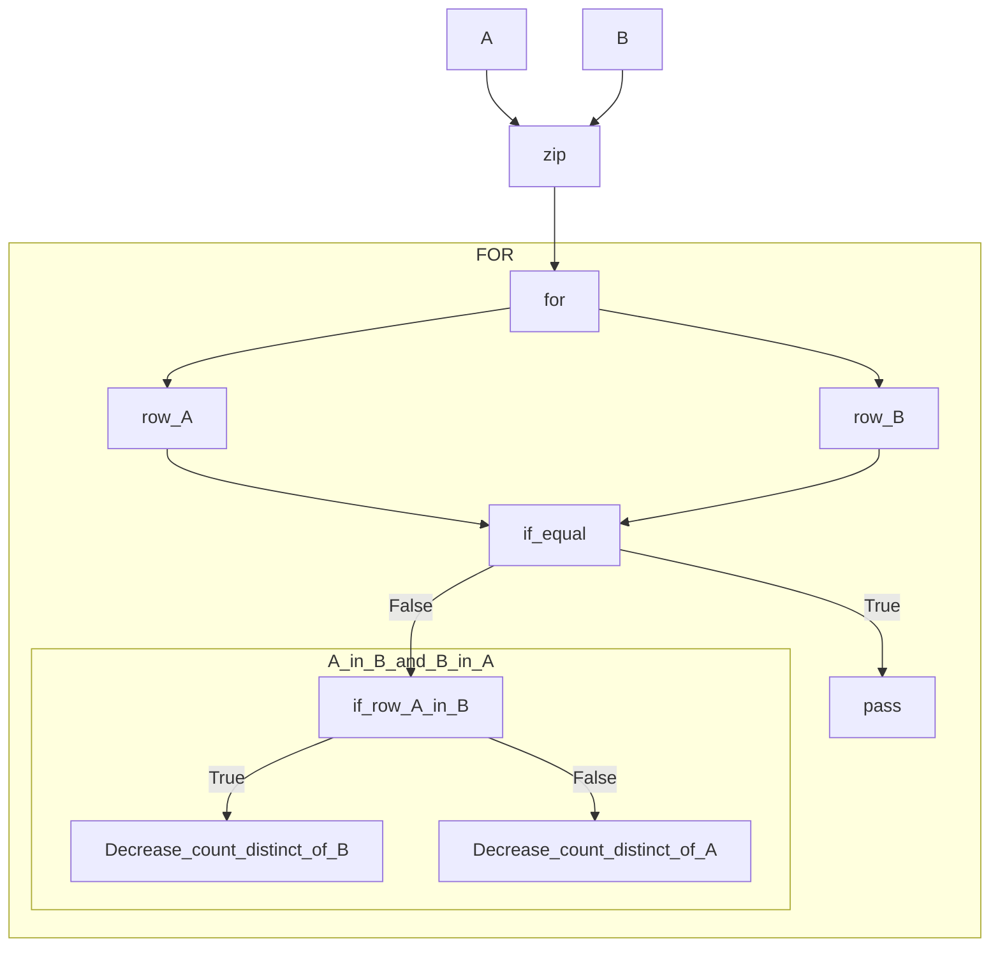

# pandas-sets: distinct

## El problema

Dados dos conjuntos (dataframes) A y B quiero obtener conjuntos (las filas) que
no pertenecen a la intersección. Es decir, los items que son distintos entre
ambos conjuntos.


### con un ejemplo

Notar que:

- comparación element-wise no posible porque el orden importa y en el DF pueden
  estar desordenados.
- No quiero perder información de cuantas veces se repite un item del conjunto.


### Naive
```python
left = pd.DataFrame([
    [1, 2, 3],
    [1, 2, 33]           # diff <---+
])                       #          |
                         #          |
right = pd.DataFrame([   #          |
    [1, 2, 3],           #          |
    [1, 2, 3]            # diff <---+
])
left_expected = pd.DataFrame([[1, 2, 33]], index=[1])
right_expected = pd.DataFrame([[1, 2, 3]], index=[1])

left_obtained, right_obtained = utils.distinct(left, right)
```


### Complejo

```python
left = pd.DataFrame([
    [1, 2, 3],  # a
    [1, 2, 3],  # a
    [1, 2, 33]  # b
    ],
    index=["a", "a", "b"],
)
right = pd.DataFrame([
    [1, 2, 3],  # a
    [1, 2, 33]  # b
    ],
    index=["b"],
)

left_expected = pd.DataFrame([
    [1, 2, 3], # a
    ],
    index=["a"],
)
right_expected = pd.DataFrame([], columns=[0, 1, 2], index=[])

left_obtained, right_obtained = utils.distinct(left, right, subset=[1, 2])
```


### Manteniendo el comportamiento que tienen los conjuntos:


Quiero mantener el mismo comportamiento que en los `set`:

```python
>>> l = {1,2,3}
>>> r = {1,3}
>>> l - r
{2}
>>> r - l
set()
>>>
```


# Implementación base



